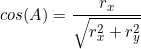

[//]: # ( https://www.codecogs.com/latex/eqneditor.php)

Area of region
===============
When we hit a leaf node in a quadtree/mipmap, it may be valuable to know how much of the area of the node is occupied by the right of the line. Take the image below for example.

  

What if we want to know how what percentage of the square is colored green? This may be useful in images for anti-aliasing purposes.

Well, the area of a triangle is easy to calculate: 1/2*w*h.
But how to find w & h? That requires knowing exactly where the line intersects the sides of the square... Which means using divisions/multiplications... For every pixel... Not nice.

Similar to the square right of line traversal, we can take advantage of how the square moves during traversal. Look at that point in the image, the Far point in our square-right-of-line traversal. We know how that point moves during traversal, thats how the square right of line test was optimized. If you are good at math, maybe you see an easy to get the area from this. But I'm not, so lets do some very lengthy trigonometry and maths.

  

- w & h are the width and height of the triangle, these are what we are trying to find. These values will change during traversal.

- r is the line we are checking to the right of, the "Ray". This value is constant during traversal.

- p is the vector from the Far Point that is right of the line, and the beginning of the ray r. This is the only variable we are changing during traversal.

- B,C, & E are all angles that will be constant through the traversal, because the angle between the sides of the square and the line will never change with different positions & shapes of the square.

- D is the angle between the ray r and the p vector. This value will change during traversal.

First, we will try to find length w. Right now, we have p as a vector, and not it's length, but lets just go ahead and pretend we have it's length (it can be calculated with square roots and multiplies), called |p|.

We also have angle D. How so? The equation used to measure the clockwiseness (a.x*b.y-a.y*b.x) of the far point. That is based on the cross-product, which means it's value is |r|*|p|*sin(D). So we don't have the angle, but we have the sin of the angle.

And we have the angle C because it's a constant during traversal.

From these three variables, we can use [Angle-Angle-Side maths](https://www.mathsisfun.com/algebra/trig-solving-aas-triangles.html) to find the length w.

  

And now we can use the length w and the angle A to find h. 

  

  

Then the area of this triangle is:

  

substitute the clockwiseness equation for Sin(D):

  

Substitute the value |p|:

  

Simplify:

  

  

Realize that C = PI-A, and sin(PI-x)-sin(x):
Therefore sin(C)=sin(A):

  

  

  

  

  

  

  

And thats probably the most simple calculation for this problem. It's still not exactly great, we must have the square of the clockwiseness calculation, and then must divide by a constant. This can be done with reciprocal multiplication, but means we still need to do a division before we begin this quadtree traversal. 