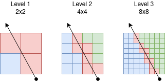
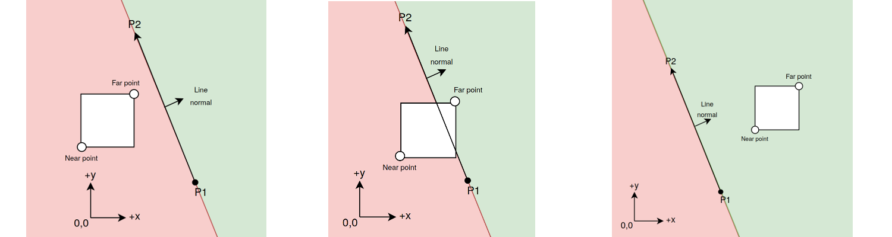
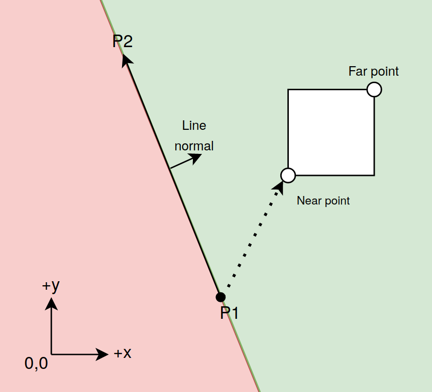

###
Side of line - quadtree pre-order traversal
===========
Introduction
-----------
Suppose you have a (infinite) line and a quadtree. You would like to traverse every node in the quadtree that is to the right of (or intersecting) the line.
If your quadtree is a complete tree, you have a structure similar to a mipmap image.

  

In the 3 squares above, you can see three levels of a complete quadtree (or a mipmap, whichever you prefer to think of it as). Every square right of the line
is green, every square left of the line is blue, and every square that intersects
the line is red.

Traversing such a quadtree is a very simple operation. Starting at the root node,
only visit each child node if the square region of that child is to the right of or on the given line.

Testing if a square is right of a line
------------
To check if a square is to the right of a line, we must have a direction to the line, otherwise its hard to define what "right" is. I will use a 2D ray, which consists of a starting point P1, and a direction point P2.

  

In the first image above, the square is completely left of the line. In the second image, the square overlaps the line. In the last image, the square is completely right of the line. Look at the two points on the square in each image, labeled "Near point" and "Far point". We only need to test these two points to see if the square is left, right, or overlapping the line.

Now how do we pick these two points? Look at what I call the Line normal, the arrow pointing directly right of the line. The Near point is the corner of the square that is closest to the opposite of the Line normal, and the Far point is the corner of the square that is closest in the direction of the Line normal.
Since the square is axis-aligned, this is easy, and we only need to look at the sign of the normal line. The normal line is just the line P2-P1 rotated right. The following C psudocode can describe this process.

    int dx = P2.x - P1.x;
    int dy = P2.y - P1.y;
    // Rotate dx,dy right by 90 degrees
    int normal_x = dy;
    int normal_y = -dx;

    int near_point_x = (normal_x >= 0) ? (square.x) : (square.x + square.width);
    int near_point_y = (normal_y >= 0) ? (square.y) : (square.y + square.height);
    int far_point_x = (normal_x >= 0) ? (square.x + square.width) : (square.x);
    int far_point_y = (normal_y >= 0) ? (square.y + square.height) : (square.y);

Now we just have to check if each of these points is left or right of the line. That can be done like so:

  

If the line NearPoint-P1 is clockwise of the line P2-P1, the point NearPoint is right of the line. Same story for the Far point. To perform this clockwise-ness test, we can use equation (sometimes called a 2D cross product):

    dx * (near_point_y - P1.y) - dy * (near_point_x - P1.x)

If this value is negative, the near point is right of the line. If this is zero, the near point lies exactly on the line. If positive nonzero, the point is to the left of the line.

Finally, we have to decide from these points if the square is completely right, left, or overlapping the line. If the near point is clockwise, the square is completely right of the line (the far point is implied to also be right of the line then). If the near point is anti-clockwise, we have to check if the far point is clockwise. If so, the square overlaps the line, otherwise the square is completely left of the line.

Complete psudocode:
------

    int dx = P2.x - P1.x;
    int dy = P2.y - P1.y;
    // Rotate dx,dy right by 90 degrees
    int normal_x = dy;
    int normal_y = -dx;

    int near_point_x = ((normal_x >= 0) ? (square.x) : (square.x + square.width)) - P1.x;
    int near_point_y = ((normal_y >= 0) ? (square.y) : (square.y + square.height)) - P1.y;
    int far_point_x = ((normal_x >= 0) ? (square.x + square.width) : (square.x)) - P1.x;
    int far_point_y = ((normal_y >= 0) ? (square.y + square.height) : (square.y)) - P1.y;

    int near_clockwise = dx * near_point_y - dy * near_point_x;
    int far_clockwise = dx * far_point_y - dy * far_point_x;

    bool square_completely_right = near_clockwise < 0;
    bool square_partially_right = far_clockwise <= 0;

    if (square_completely_right)
        return square_is_right_of_line;
    else if (square_partially_right)
        return square_overlaps_line;
    else
        return square_is_left_of_line;

Traversal optimizations
=======
That code as-is isn't too expensive to calculate for every square we encounter in a quadtree traversal, but it can be optimized some more anyway.

During traversal, the only variables that change are _square.x_, _square.y_, and _square.width_. _square.width_ is a power or two, and it is divided by 2 every time we go deeper into the tree. Here is a table of the space occupied by a node and its four children.
| node | space occupied      |
|------------|---------------|
|Parent      | \[square.x, square.y] x \[square.width, square.width] |
| top-left child   | \[square.x, square.y] x \[square.width/2, square.width/2] |
| top-right child   | \[square.x + square.width/2, square.y] x \[square.width/2, square.width/2] |
| bottom-left child | \[square.x, square.y + square.width/2] x \[square.width/2, square.width/2]
| bottom-right child | \[square.x + square.width/2, square.y + square.width/2] x \[square.width/2, square.width/2]
---

This makes it easy(ish) to optimize the calculation for both _near_clockwise_ and _far_clockwise_ between a parent node and each of its children. If you want to understand how so, go ahead and work it out on paper. Theres just a lot of if's to deal with, so I won't do it here.

---

 Lets define a struct with the information we need during traversal:

    struct SquareTraversal {
        int normal_x; // Only need the sign
        int normal_y; // Only need the sign
        int near_clockwise, far_clockwise;
        int dx, dy;
        int depth; // Depth from the root node
    }
---
And now initialize it for a parent node:

    SquareTraversal SquareTraversal_init(Point P1, Point P2, Square square) {
        SquareTraversal traverser;
        int dx = P2.x - P1.x;
        int dy = P2.y - P1.y;
        traverser.normal_x = dy;
        traverser.normal_y = -dx;

        int near_point_x = ((traverser.normal_x >= 0) ? (square.x) : (square.x + square.width - 1)) - P1.x;
        int near_point_y = ((traverser.normal_y >= 0) ? (square.y) : (square.y + square.height - 1)) - P1.y;
        int far_point_x = ((traverser.normal_x >= 0) ? (square.x + square.width - 1) : (square.x)) - P1.x;
        int far_point_y = ((traverser.normal_y >= 0) ? (square.y + square.height - 1) : (square.y)) - P1.y;
    
        traverser.near_clockwise = dx * near_point_y - dy * near_point_x;
        traverser.far_clockwise = dx * far_point_y - dy * far_point_x;
        // Delta values added to either near or far clockwise-ness depending on which child.
        traverser.dx = -dy * square.width / 2;
        traverser.dy = dx * square.width / 2;
        traverser.depth = 0;
        return traverser;
    }
---
The function to test if the square is right of a line from a SquareTraversal struct is very simple:

    bool SquareTraversal_GetRightOfLine(SquareTraversal *p_traversal, bool *out_is_completely_right) {
        *out_is_completely_right = p_traversal->near_clockwise < 0;
        return p_traversal->far_clockwise <= 0;
    }
---
And now the function for going into a child node.
This has fewer overall calculations and no multiplications.

    // dx is nonzero to select a right child, zero to select a left child.
    // dy is nonzero to select a bottom child, zero to select a top child.
    SquareTraversal_GoToChild(SquareTraversal *p_traverser, int dx, int dy) {
        int local_dx = p_traverser->dx >> p_traverser->depth;
        int local_dy = p_traverser->dy >> p_traverser->depth;

        if (p_traverser->normal_x >= 0) {
            if (dx)
                p_traverser->near_clockwise += local_dx;
            else
                p_traverser->far_clockwise -= local_dx;
        } else {
            if (dx)
                p_traverser->far_clockwise -= local_dx;
            else
                p_traverser->near_clockwise += local_dx;
        }

        if (p_traverser->normal_y >= 0) {
            if (dy)
                p_traverser->near_clockwise += local_dy;
            else
                p_traverser->far_clockwise -= local_dy;
        } else {
            if (dy)
                p_traverser->far_clockwise -= local_dy;
            else
                p_traverser->near_clockwise += local_dy;
        }

        p_traverser->depth++;
    }

---
Another advantage to this traversal design is that it requires no memory stack. It is possible to undo (as in"pop") a call to _SquareTraversal_GoToChild()_.
Here is a function which takes a traverser from a node to its parent. The only information required is which child dx/dy in the parent node corresponds to the current node.

    // dx is nonzero to select a right child, zero to select a left child.
    // dy is nonzero to select a bottom child, zero to select a top child.
    SquareTraversal_GoToChild(SquareTraversal *p_traverser, int parent_dx, int parent_dy) {
        p_traverser->depth--;
        int local_dx = p_traverser->dx >> p_traverser->depth;
        int local_dy = p_traverser->dy >> p_traverser->depth;

        if (p_traverser->normal_x >= 0) {
            if (dx)
                p_traverser->near_clockwise -= local_dx;
            else
                p_traverser->far_clockwise += local_dx;
        } else {
            if (dx)
                p_traverser->far_clockwise += local_dx;
            else
                p_traverser->near_clockwise -= local_dx;
        }

        if (p_traverser->normal_y >= 0) {
            if (dy)
                p_traverser->near_clockwise -= local_dy;
            else
                p_traverser->far_clockwise += local_dy;
        } else {
            if (dy)
                p_traverser->far_clockwise += local_dy;
            else
                p_traverser->near_clockwise -= local_dy;
        }
    }

