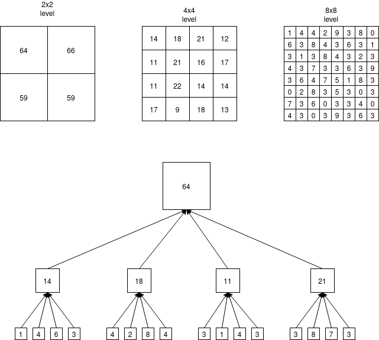
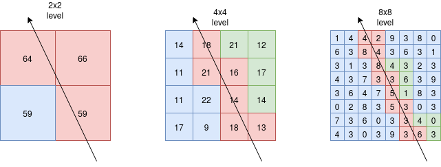
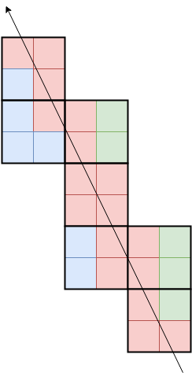
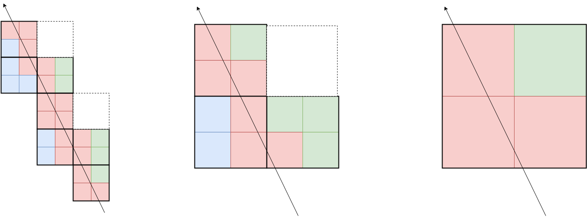
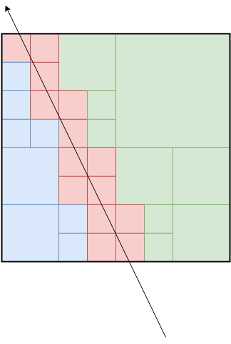

Side of line - quadtree depth-first traversal
===========
Introduction
-----------
Suppose you have a complete quadtree / mipmap image like the picture below:

  

Each square at a level is the sum of the contained 2x2 squares in the next lower level.
This is basically a [mipmap](https://en.wikipedia.org/wiki/Mipmap), but without averaging.

Now what if you want to get the sum of all squares that are to the right of a line? How can that be done with as few memory operations as possible?

  

- blue indicates a region we don't need to access.
- red indicates a region which intersects the line, there isn't enough information and we need to go deeper.
- green is a square that is completely right of the line.

Taking only the sum of the green squares will give the total sum of all squares to the right of the line. In the 4x4 level, all the green values {21, 12, 17, & 14} give the sums of those squares in the lower levels. There is no need to access the level 8x8 squares at all, so these squares are marked in blue.

Depth-first traversal
---

An [earlier document](../square_right_of_line/square_right_of_line.md) shows how to optimize a quadtree traversal that can be used to optimize this task. However, it is a designed pre-order traversal. If each level is made of a standard bitmap layout, a pre-order traversal may provide an less than optimal memory access pattern. If you know you want to access all nodes in this way, a depth-first traversal may be better. The down side to a depth-first traversal is that it's not really possible to skip nodes by user data, the only way nodes are skipped is if the parent node square is completely right of the line. 

Now we need an optimal algorithm for finding which squares are needed for each depth in the tree (aka mipmap level). You might think some algorithm iterating from y-min to y-max, over the line at each row, something like this algorithm:

    int sum = 0;
    for (int y = 0; y < height; y++) {
        int x_begin = line_y_axis_intersection(P1, P2, y);
        for (int x = x_begin; x < width; x++)
            sum += squares[level, x, y];
    }

But the problem with this is that it will access **every** square that is right of the line for every level. In the example above, it would read the blue region in the upper-right part of the 8x8 level. This is unnecessary bandwidth we want to avoid. Perhaps you could come up with an algorithm which communicates with the upper level in the tree and avoids these squares which are fully right of the line. But there is a better solution.

 For each level in the tree, only read the squares which are exactly on the line. That sounds plainly wrong, eh? Well there is one extra detail, you must traverse the line treating it as 2 squares wide, not 1.

  

It's not **exactly** like a drawing a line with a width of 2, rather, treat each square (or pixel) as twice its size. Now, in that image, it certainly appears that we didn't touch any squares far right of the line. That is intentional, the higher up squares will cover them. Look at the images below, and imagine them going recursively.

  

The image in the middle is the level one above the image left image. The image to the right is the level one above the image in the middle. Every white square in any level is guaranteed to be a green square in the higher up level. I have no interest in writing a formal proof for this right now, hopefully the images convincing enough if it makes sense to you. Putting them all together shows that all squares right of the line are indeed green.

To put them all together, go from the root (the image to the right), and keep all green & blue squares. All red squares get replaced with the corresponding set of 4 squares in the lower level (the image to the left).

  

The number of green squares is the minimum possible. This is what we want, it allows us to get the sum of all the data right of the line as efficiently as possible.

DFS traversal
---
To do this traversal, we basically need this algorithm:

    int SumRightOfLine(Point P1, Point P2, int square_width, int *tree_pixels[depth]) {
        int max_depth = log2(square_width);
        int sum = 0;
        for (int depth = 0; depth < max_depth; depth++) {
            int current_width_of_pixel = square_width >> (depth + 1);
            int current_num_pixels_wide = square_width / current_width_of_pixel;
            
            Point current_P1 = P1 / (current_width_of_pixel * 2);
            Point current_P2 = P2 / (current_width_of_pixel * 2);
            float sideways_slope = (current_p2.x - current_p1.x) / (current_p2.y - current_p1.y);
            for (int y = 0; y < ceil(current_num_pixels_wide / 2); y++) {
                int start_x = current_P1.x + y * sideways_slope;
                for (int x = 0; x < ceil(current_num_pixels_wide / 2); x++) {
                    // Top-left point of current 2x2 pixel
                    if (PointRightOfLine(Point(x*2+0, y*2+0), current_P1*2, current_P2*2))
                        sum += tree_pixels[depth][(y*2+0) * current_num_pixels_wide + (x*2+0)];

                    // Top-right point of current 2x2 pixel
                    if (PointRightOfLine(Point(x*2+1, y*2+0), current_P1*2, current_P2*2))
                        sum += tree_pixels[depth][(y*2+0) * current_num_pixels_wide + (x*2+1)];
                        
                    // Bottom-left point of current 2x2 pixel
                    if (PointRightOfLine(Point(x*2+0, y*2+1), current_P1*2, current_P2*2))
                        sum += tree_pixels[depth][(y*2+1) * current_num_pixels_wide + (x*2+0)];

                    // Bottom-right point of current 2x2 pixel
                    if (PointRightOfLine(Point(x*2+1, y*2+1), current_P1*2, current_P2*2))
                        sum += tree_pixels[depth][(y*2+1) * current_num_pixels_wide + (x*2+1)];
                }
            }
        }
        return sum;
    }

That code is not tested, and is over-simplified. It won't handle cases where the line P1-P2 is pointing down for example. But I hope it gives the idea: for each level in the quadtree, take every every 2x2 square region on the line. For each of the 4 squares in that square region, only take the ones that are right of the line. Note that this algorithm only sums the data that is right of the line. If we want to include the squares that lie exactly on the line, only the leaf level in the quadtree needs to handle that seperately. It should be pretty easy to modify.

Optimizations
===
That algorithm can be optimized by combining two optimized algorithms: a line drawing/traversing algorithm, and the same [square-right-of-line test](../square_right_of_line/square_right_of_line.md) optimied earlier for pre-order traversal (with some changes). For the line traversal, you might try Bresenham's algorithm, but it scares me on some cases. I worry the line algorithm may "skip" some pixels which just barely touch the edge of a square. I will just modify the square-right-of-line test to make it work for traversal.

---
Here is the structure we will use to traverse a single level in the quadtree:

    struct LevelTraverser {
        
    }